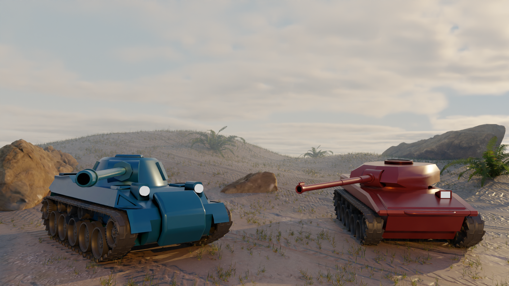

# Covert Combat

KSU CSE 1321's Exhibition Game!

***Covert Combat*** is a two player, 1-versus-1 top down tank shooting game that places the two players in random locations on a map amongst a sea of computer-controlled tanks. The two players must first find out which tank is theirs, and then find their enemy's and destroy it before their enemy does the same. The primary purpose of the game is to provide entertainment by creating competition between the two players as they hunt for themselves and each other.

The purpose of this README is to explain the overall structure of the game, and how it works.

#Quick Start Guide
To start the game, run [main.py](main.py). There will be instructions on how to play on screen.

To change the resolution to fit your screen, open [settings.py](settings.py) and change the tuple `res` to equal your resolution. For example, if you are running a 1920x1080, change that line to be 
`res = WIDTH, HEIGHT = 1920, 1080`

You can also change any other settings that are ***ABOVE*** line 92, but don't be surprised if it gets very buggy very quickly.

If you want to change the map's layout, go to [map.py](map.py) and change the `mini_map` list-of-lists. A `1` in a cell represents a brick square corresponding on the game map, and a `_` represents an empty space.

# Flow of the Program
The game enters with [main.py](main.py). main.py has a class `Game` defined, which an instance is automatically created if main.py is the original program opened by the user.

Class `Game`'s constructor initializes pygame, the display, the sound mixer, and the game's clock.

Immediately after creating a 'Game' instance, the `Game` instance's `run()` method is called, which kicks off the game.

`run()` starts by calling the method `start_menu()`, which displays instructions to the user, and starts it's own infinite loop until a user presses the spacebar. After that, the Main Loop is started.

## The Main Loop
The main loop runs infinitely until a player presses the escape key. It is called the main loop because it contains all the actual content of the game, and is responsible for restarting rounds when they are finished.

It begins by calling the `new_game()` method, which loads in the map, creates the sprites and sprite groups for the NPCs and Players, and then spawns them using an algorithm that finds empty spaces on [`map.mini_map`](map.py). Once all NPCs and players are spawned, `new_game()` returns and `run()` continues into the Game Loop,

### The Game Loop
The game loop runs infinitely until the amount of players is less than two, which means one has died. The Game loop controls the actual gameplay, by updating the game and drawing all objects to screen per-frame. It calls `Game`'s methods `update()` and `draw()`, which in turn call all NPC, wall, explosion, shell, and player object's `update()` and `draw()`.

Once the Game Loop exits from a player dying, the `victory_screen()` method is called, which displays the winner. The exiting of the Game Loop also causes all updating and drawing of game objects to halt, stopping all movement. `victory_screen()` waits for a spacebar press to return, and then the Main Loop begins again, calling `new_game()` and then starting the Game Loop.

# The Tanks
Both types of tanks, [`Player`](player.py) and [`NPC`](NPC.py), derive from class [`BaseTank`](BaseTank.py), which defines the tank movement system (`apply_movement()`) and collision system (`checkCollision()`), along with how tanks should be drawn. (`draw()`)

`BaseTank` in turn derives from `pygame.sprite.Sprite` which has a lot of handy functions, like `kill()` that is used to remove players and NPCs.

## `destroy()` and `DeadTank`
When a `BaseTank` is killed, it creates an instance of `DeadTank` that represents that tank's burning chassis on the screen. `DeadTank` in turn creates an `Explosion` object, which displays an explosion animation on screen and destroys itself after the explosion animation ends. After the `DeadTank` is created, `destroy()` calls the `BaseTank`'s `kill()`.

## Shooting Mechanics
Only [`Player`](player.py)s can shoot in game. They do so by creating an object of class `Shell` (derived also from `pygame.sprite.Sprite`) and passing to it the tank's current position and turret angle. Shells fly until they collide with something, in which case they call their own `kill()` method.

# Collisions
[`Shell`](player.py) objects and [`BaseTank`](BaseTank.py) objects use a similiar collision method. They are both named `checkCollision()`. Collisions work using pygame's `spritecollide()` function, which checks for pixel collisions between two sprite's `mask` attribute. Every frame, an object checks for these collisions against spritegroups in it's attribute list `collidables`. 

If a collision is detected, then the collision methods for the classes diverge.

For `BaseTank`'s, then a lot of trignometry is then used to find the inverse of the bisecting angle between the velocity of the tank and the collision point, which is then used in `apply_movement()` to calculate the deflection velocity for the tank.

For `Shell`'s, the type of the object collided against is checked to be of type `BaseTank`. If it is, then the collided objects' `destroy()` method is called.

# The Map
The map is defined in [`map.py`](map.py). `Game.new_game()` creates an instance of class `Map`. In it's constructor, the `Map` object creates a spritegroup for the walls, called `walls`. It also iterates through the list-of-lists `mini_map` and creates class `Wall` instances based on which cells in `mini_map` are filled. 

The map is drawn on screen by the `map`'s `draw` being called by `Game.draw()` inside the [Game Loop.](#the-game-loop)

# NPC Movement Generation

NPC's movement logic is generally;
1. Find a tile adjacent to the NPC that is empty,
2. Rotate the NPC towards that tile
3. Drive either forwards or backwards until there is a collision.
4. If there is a collision, restart the process.

To do this, there are two components to how NPC's generate movement;
- The Movement State, which is an integer either in `forwardState` equalling 1, `decelerationState` equalling 2, or `backwardState`equalling 3.
-  The desired directional angle of the tank `direction`, and whether the tank should rotate in that direction presently, the boolean `ShouldRotate`.

What state the NPC is defined in `NPC.update()`. It relies on whether or not a collision has occured in a frame. If there has been a collision, evident by the first value of `isColliding[]` equalling `True`, then the NPC's movement state switches to `decelerationState` until it's deflection velocity is near 0, [and a new direction is picked](#finding-a-viable-direction). If the NPC is not colliding with anything that frame, then there is a 1% chance of the NPC changing direction and a 5% chance of changing to a random movement state.

## Finding a viable direction
`NPC.changeDirection()` finds empty adjacent spaces by checking `Map.mini_map`. They do some indexing math to find their location in the array using their current screen position, and then check spaces adjacent to theirs in series like a tic-tac-toe board. They pick one at random, and set `direction` to that cell's angle relative to them.

## Moving the NPC to it's set direction
`NPC` objects generate their movement inside of `get_movement()`, similiar to how `Player` objects get player input inside of their own `get_movement()`. In `get_movement()`, a switch statement performs the logic specific to which movement state the NPC is in. If `ShouldRotate` is set to `True`, then the NPC also rotates towards angle `direction`. The turret will also rotate towards a random angle if `ShouldRotate` is `False`.